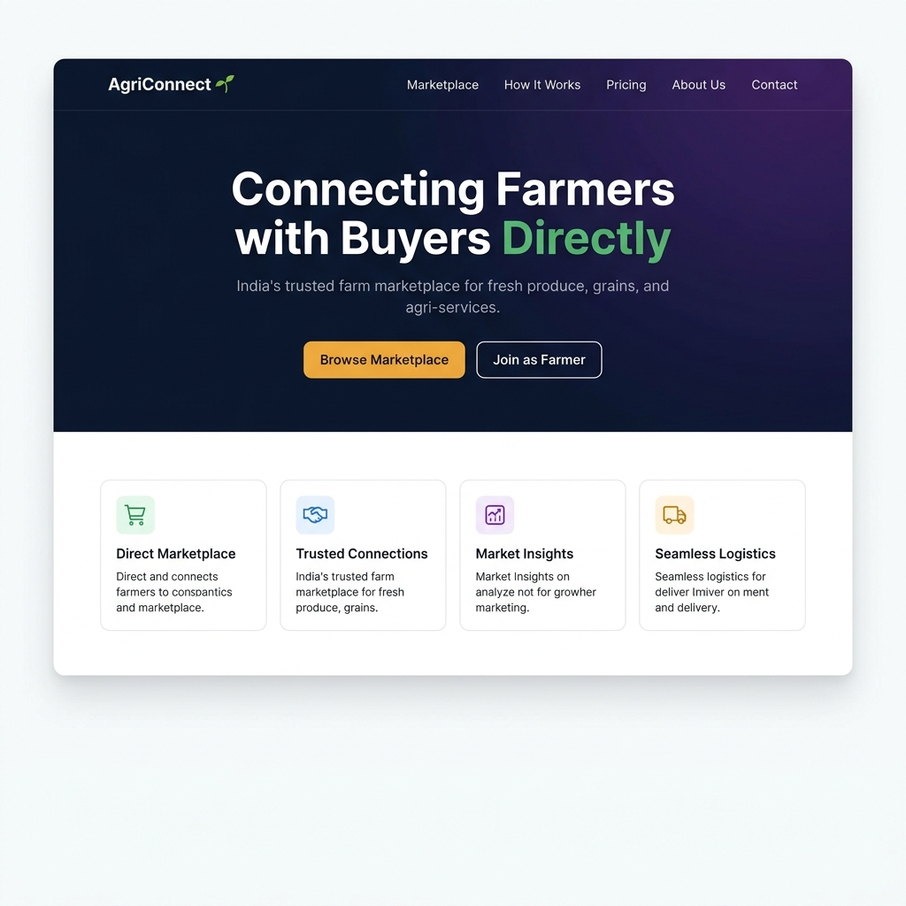
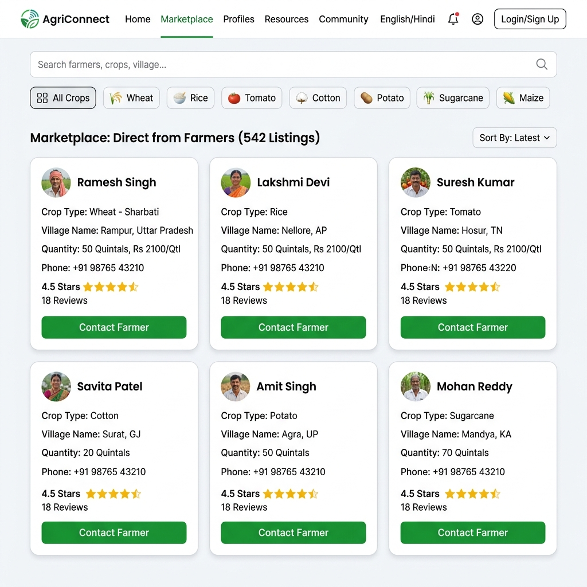
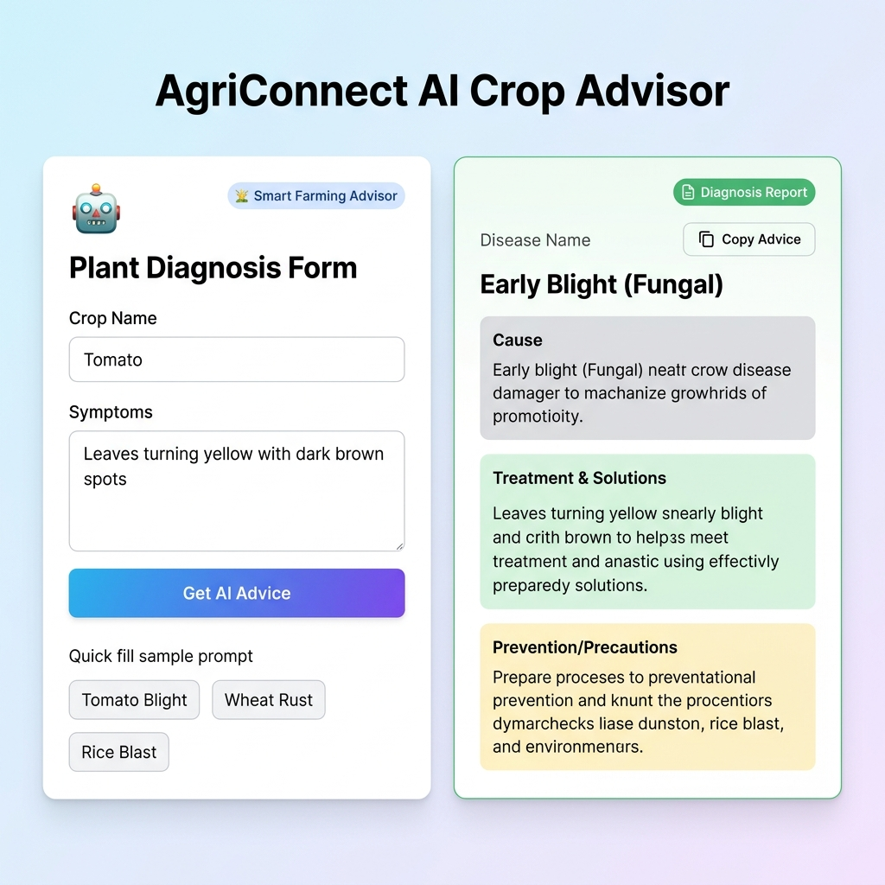
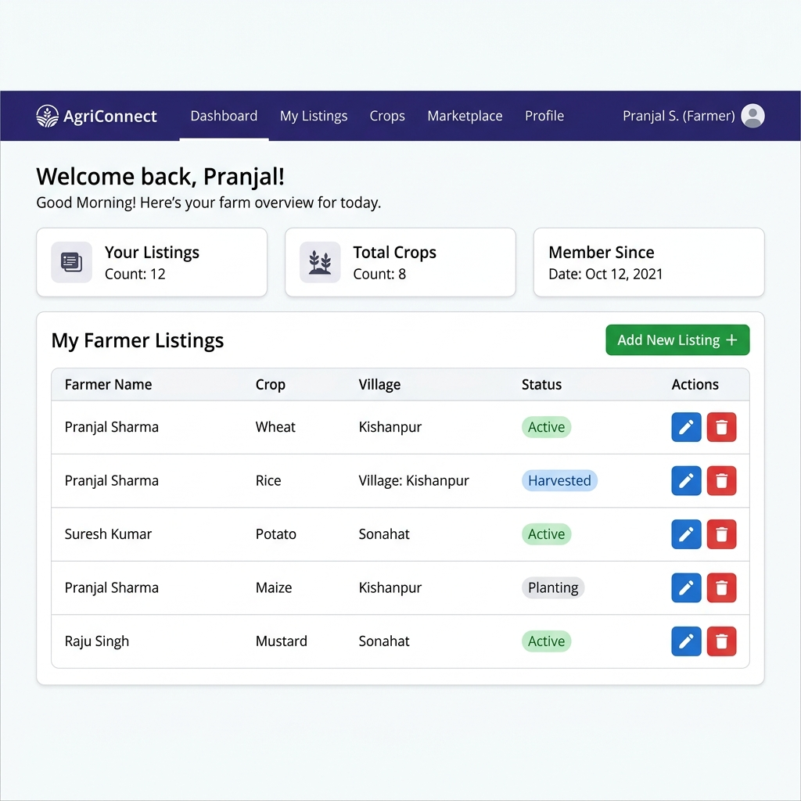

# 🌱 AgriConnect

<div align="center">

**Connecting Farmers with Buyers — Directly**

India's trusted digital marketplace for agricultural commerce, powered by AI.

[](https://agri-connect-pearl-chi.vercel.app/)
[](https://github.com/PranjalSingh-dev/AgriConnect)
[](https://www.linkedin.com/in/pranjal-singh-dev)

</div>

---

## 📌 Table of Contents

- [Project Overview](#-project-overview)
- [Live Demo](#-live-demo)
- [Features](#-features)
- [Screenshots](#-screenshots)
- [Tech Stack](#️-tech-stack)
- [Project Structure](#-project-structure)
- [Getting Started](#-getting-started)
- [AI Feature — Crop Advisor](#-ai-feature--crop-advisor)
- [API Reference](#-api-reference)
- [Deployment](#️-deployment)
- [Known Limitations](#️-known-limitations--free-tier)
- [Author](#-author)

---

## 🌍 Project Overview

**AgriConnect** is a full-stack web application built during the **TBI Internship (Weeks 4–7 + AI Week 7 + Deployment Week 9)** capstone at GEU (Graphic Era University). It solves a real-world problem: Indian farmers often lack digital tools to connect directly with buyers, resulting in heavy dependence on middlemen and unfair pricing.

AgriConnect provides a **verified farmer marketplace**, **JWT-secured user accounts**, **full CRUD listing management**, and an **AI-powered crop disease advisor** backed by Google Gemini — all deployed live on Vercel + Render.

> **Intern ID:** TBI-26100412

---

## 🔗 Live Demo

| Service | URL |
|---------|-----|
| **🌐 Frontend (Vercel)** | [https://agri-connect-pearl-chi.vercel.app/](https://agri-connect-pearl-chi.vercel.app/) |
| **⚙️ Backend API (Render)** | [https://agriconnect-r4bm.onrender.com/](https://agriconnect-r4bm.onrender.com/) |
| **📁 GitHub Repository** | [https://github.com/PranjalSingh-dev/AgriConnect](https://github.com/PranjalSingh-dev/AgriConnect) |

> ⚠️ **Note:** The backend is on Render's free tier and may take **30–60 seconds** to wake up on the first request after a period of inactivity.

---

## ✨ Features

### 🖥️ Frontend (React + Vite)
- Responsive SPA with React Router DOM navigation
- **Farmers Marketplace** — search by keyword, filter by crop type
- **Dynamic data** fetched live from MongoDB-backed REST API
- **Loading states & error handling** on all async operations
- **User Registration & Login** (JWT authentication)
- **Google OAuth** simulation login flow
- **Protected Routes** — Dashboard & Farmer CRUD require authentication
- **User Dashboard** — view, create, edit, and delete your own farmer listings
- **🤖 AI Crop Advisor** — instant crop disease diagnosis via Google Gemini
- **Consultation history** — last 5 AI diagnoses stored in localStorage
- **Copy to clipboard** for diagnosis reports
- Fully responsive across mobile, tablet, and desktop

### ⚙️ Backend (Node.js + Express)
- RESTful API using Express.js v5
- **MongoDB + Mongoose** for persistent data storage
- Complete **CRUD operations** for farmer listings (JWT-protected mutations)
- **Search API** — filter by keyword, crop type, and village
- **Zod** schema validation on all inputs
- **bcryptjs** password hashing + **JWT** authentication
- **Rate limiting** on auth endpoints (express-rate-limit)
- **CORS** configured for Vercel + Render + localhost
- **🤖 Google Gemini AI integration** (`POST /api/ai/crop-advice`)
- Graceful error handling with centralized error middleware
- `.env`-based config — no secrets ever committed

---

## 📸 Screenshots

### 🏠 Home Page — Hero & Feature Cards


---

### 🛒 Marketplace — Farmer Listings with Search & Filters


---

### 🤖 AI Crop Advisor — Gemini-Powered Disease Diagnosis


---

### 📊 User Dashboard — Manage Your Listings


---

## 🛠️ Tech Stack

| Layer | Technology | Purpose |
|-------|-----------|---------|
| **Frontend Framework** | React 19 + Vite 8 | SPA with fast HMR |
| **Routing** | React Router DOM v7 | Client-side navigation |
| **Styling** | Tailwind CSS v4 + Vanilla CSS | Utility + custom design system |
| **Backend** | Node.js + Express.js v5 | RESTful API server |
| **Database** | MongoDB + Mongoose v9 | Persistent data storage |
| **Authentication** | bcryptjs + JSON Web Tokens | Secure user auth |
| **Validation** | Zod v4 | Runtime input validation |
| **AI** | @google/generative-ai (Gemini 2.5 Flash) | Crop disease advisor |
| **Rate Limiting** | express-rate-limit | Brute-force protection |
| **Frontend Host** | Vercel | Global CDN deployment |
| **Backend Host** | Render | Node.js hosting |
| **Database Host** | MongoDB Atlas | Cloud database |

---

## 📂 Project Structure

```
AgriConnect/
├── docs/
│   └── screenshots/                  # README screenshots
│
├── frontend/                         # React + Vite app
│   ├── public/
│   ├── src/
│   │   ├── components/
│   │   │   ├── Navbar.jsx            # Responsive nav with auth state
│   │   │   ├── Hero.jsx              # Landing hero section
│   │   │   ├── Card.jsx              # Farmer listing card
│   │   │   ├── Footer.jsx            # Site footer
│   │   │   ├── ProtectedRoute.jsx    # JWT-gated route wrapper
│   │   │   └── ui/
│   │   │       ├── Loader.jsx        # Animated spinner
│   │   │       └── Toast.jsx         # Toast notification
│   │   ├── pages/
│   │   │   ├── Home.jsx              # Landing page
│   │   │   ├── Marketplace.jsx       # Farmer search & browse
│   │   │   ├── About.jsx             # About page
│   │   │   ├── Login.jsx             # Login + Register
│   │   │   ├── Dashboard.jsx         # Protected: user listings
│   │   │   ├── AddFarmer.jsx         # Protected: create / edit listing
│   │   │   └── AIAssistant.jsx       # AI crop advisor
│   │   ├── config/api.js             # API base URL (env-aware)
│   │   ├── App.jsx                   # Route definitions
│   │   └── main.jsx                  # App entry point
│   ├── index.html
│   ├── vercel.json                   # SPA rewrite rule for Vercel
│   └── package.json
│
├── backend/                          # Node.js + Express API
│   ├── config/
│   │   └── db.js                     # MongoDB connection
│   ├── controllers/
│   │   ├── authController.js         # Register, login, Google OAuth
│   │   ├── farmerController.js       # CRUD + search logic
│   │   └── ai.controller.js          # Gemini AI handler
│   ├── middleware/
│   │   ├── authMiddleware.js         # JWT verification
│   │   └── errorMiddleware.js        # Centralized error handler
│   ├── models/
│   │   ├── User.js                   # User schema (email, password hash)
│   │   └── Farmer.js                 # Farmer schema (name, crop, village)
│   ├── routes/
│   │   ├── authRoutes.js             # /api/auth/*
│   │   ├── farmerRoutes.js           # /api/farmers/*
│   │   └── ai.routes.js              # /api/ai/*
│   ├── services/
│   │   └── gemini.service.js         # Gemini API wrapper + fallback
│   ├── .env.example                  # Environment variable template
│   ├── render.yaml                   # Render deployment config
│   └── server.js                     # Express app entry point
│
├── .env.example                      # Root env template
├── .gitignore                        # Excludes .env, node_modules
└── README.md
```

---

## 🚀 Getting Started

### Prerequisites

- **Node.js** v18 or higher
- **MongoDB** running locally on port `27017`
- **Google Gemini API Key** — free at [aistudio.google.com](https://aistudio.google.com/apikey)

### 1. Clone the Repository

```bash
git clone https://github.com/PranjalSingh-dev/AgriConnect.git
cd AgriConnect
```

### 2. Backend Setup

```bash
cd backend
npm install
```

Create a `.env` file (copy from `.env.example`):

```env
PORT=5000
MONGO_URI=mongodb://127.0.0.1:27017/agriconnect
JWT_SECRET=your_super_secret_key_here
GEMINI_API_KEY=your_gemini_api_key_here
CLIENT_URL=http://localhost:5173
```

> ⚠️ **Never commit your `.env` file.** It is already listed in `.gitignore`.

Start the backend dev server:

```bash
npm run dev
# API running at: http://localhost:5000
```

### 3. Frontend Setup

```bash
cd ../frontend
npm install
```

Create a `.env` file (copy from `.env.example`):

```env
VITE_API_URL=http://localhost:5000
```

Start the frontend dev server:

```bash
npm run dev
# App running at: http://localhost:5173
```

---

## 🤖 AI Feature — Crop Advisor

The AI Crop Advisor is the flagship feature of AgriConnect (Week 7). It allows any farmer to describe crop symptoms in plain language and receive an instant, structured diagnosis powered by **Google Gemini 2.5 Flash**.

### How It Works

```
Farmer Input → React Form → POST /api/ai/crop-advice
    → Express Backend → Gemini API (structured JSON prompt)
        → Parsed JSON Response → Rendered in UI
            → Saved to localStorage history
```

### API Endpoint

```
POST /api/ai/crop-advice
```

**Request Body:**

```json
{
  "crop": "Tomato",
  "symptoms": "Leaves turning yellow with dark brown spots"
}
```

**Successful Response:**

```json
{
  "success": true,
  "data": {
    "disease": "Early Blight (Fungal)",
    "cause": "Fungal infection (Alternaria solani) favored by warm, humid conditions",
    "treatment": "Apply Copper Fungicide or Neem Oil spray. Remove affected lower leaves.",
    "prevention": "Avoid overhead watering. Rotate crops yearly."
  }
}
```

### Key AI Features
- **Quick-fill prompts** — one-click examples for Tomato Blight, Wheat Rust, Rice Blast
- **History panel** — last 5 diagnoses stored per device (localStorage)
- **Copy to clipboard** — share diagnosis report instantly
- **Graceful fallback** — if Gemini API is unreachable, intelligent mock responses are returned
- **No auth required** — AI endpoint is public so any visitor can try it

---

## 🔌 API Reference

### 🤖 AI Routes

| Method | Endpoint | Auth | Description |
|--------|----------|------|-------------|
| `POST` | `/api/ai/crop-advice` | None | AI crop disease diagnosis via Gemini |

### 👨‍🌾 Farmer Routes

| Method | Endpoint | Auth | Description |
|--------|----------|------|-------------|
| `GET` | `/api/farmers` | None | Get all farmer listings |
| `GET` | `/api/farmers/:id` | None | Get a farmer by ID |
| `GET` | `/api/farmers/search?q=` | None | Full-text search farmers |
| `GET` | `/api/farmers/crop/:crop` | None | Filter farmers by crop |
| `GET` | `/api/farmers/village/:village` | None | Filter farmers by village |
| `POST` | `/api/farmers` | 🔒 JWT | Create a new farmer listing |
| `PUT` | `/api/farmers/:id` | 🔒 JWT | Update a farmer listing |
| `DELETE` | `/api/farmers/:id` | 🔒 JWT | Delete a farmer listing |

### 🔐 Auth Routes

| Method | Endpoint | Description |
|--------|----------|-------------|
| `POST` | `/api/auth/register` | Register a new user (email + password) |
| `POST` | `/api/auth/login` | Login and receive a JWT token |
| `GET` | `/api/auth/google` | Google OAuth (simulation flow) |

---

## ☁️ Deployment

### Frontend — Vercel

1. Go to [vercel.com](https://vercel.com) → **New Project** → Import from GitHub → select `AgriConnect`
2. Set **Root Directory** to `frontend`
3. Vite preset is auto-detected
4. Add Environment Variable:
   ```
   VITE_API_URL = https://agriconnect-r4bm.onrender.com
   ```
5. Click **Deploy**

The `frontend/vercel.json` file contains the SPA rewrite rule that prevents 404 on direct page refresh:

```json
{
  "rewrites": [{ "source": "/(.*)", "destination": "/" }]
}
```

---

### Backend — Render

1. Go to [render.com](https://render.com) → **New Web Service** → Connect GitHub → select `AgriConnect`
2. Set **Root Directory** to `backend`
3. **Build Command:** `npm install`
4. **Start Command:** `npm start`
5. Add all Environment Variables in the Render dashboard:
   ```
   PORT          = 10000
   NODE_ENV      = production
   MONGO_URI     = mongodb+srv://<user>:<pass>@cluster.mongodb.net/agriconnect
   JWT_SECRET    = <your_strong_secret>
   GEMINI_API_KEY = <your_gemini_key>
   CLIENT_URL    = https://agri-connect-pearl-chi.vercel.app
   ```
6. Deploy and note the assigned Render URL
7. Update `VITE_API_URL` in Vercel settings to point to the Render URL → **Redeploy**

---

### 🛠️ Common Deployment Issues

| Issue | Fix |
|-------|-----|
| **CORS Error** | Ensure `CLIENT_URL` on Render matches your exact Vercel URL (no trailing slash) |
| **Missing env vars** | Check Render → Environment tab; check Vercel → Settings → Environment Variables |
| **DB connection error** | MongoDB Atlas → Network Access → Add IP `0.0.0.0/0` to whitelist Render's dynamic IPs |
| **OAuth redirect mismatch** | Update authorized redirect URIs in Google Cloud Console to include the production URL |
| **404 on page refresh** | The `frontend/vercel.json` SPA rewrite rule handles this automatically |
| **Slow first response** | Render free tier cold starts (~30–60s). Add a cron ping or upgrade for always-on. |

---

## ⚠️ Known Limitations — Free Tier

| Service | Limitation |
|---------|-----------|
| **Render (Backend)** | Spins down after 15 min of inactivity. First request after idle: **30–60s** cold start. |
| **Vercel (Frontend)** | 100 GB/month bandwidth (sufficient for demo). |
| **MongoDB Atlas (M0)** | 512 MB storage limit. |

---

## ✅ End-to-End Test Checklist

- [x] All pages load at the Vercel URL
- [x] Registration creates a new user account in MongoDB Atlas
- [x] Login returns JWT token (stored in localStorage)
- [x] Protected routes redirect unauthenticated users to `/login`
- [x] Farmer CRUD operations persist (visible in MongoDB Atlas)
- [x] AI Crop Advisor returns structured Gemini diagnosis
- [x] Google OAuth simulation login completes and redirects correctly
- [x] Dashboard shows only the logged-in user's own listings
- [x] Search and crop filter work on the Marketplace page
- [x] 404 on direct page refresh is handled by `vercel.json`

---

## 👤 Author

**Pranjal Singh**
TBI Internship Capstone — GEU (Graphic Era University)
**Intern ID:** TBI-26100412

| Profile | Link |
|---------|------|
| 🐙 GitHub | [PranjalSingh-dev](https://github.com/PranjalSingh-dev) |
| 💼 LinkedIn | [pranjal-singh-dev](https://www.linkedin.com/in/pranjal-singh-dev) |
| 🌐 Live App | [agri-connect-pearl-chi.vercel.app](https://agri-connect-pearl-chi.vercel.app/) |

---

## 📜 Internship Timeline

This project was built over **Weeks 4–9** of the **TBI-GEU Internship** program:

| Week | Deliverable |
|------|------------|
| Week 4–5 | Core frontend — React, routing, Marketplace, Farmer Cards |
| Week 6 | Backend REST API — Express, MongoDB, Mongoose CRUD |
| Week 6–7 | Authentication — JWT, bcrypt, protected routes, Dashboard |
| Week 7 | AI Feature — Google Gemini integration (AI Crop Advisor) |
| Week 9 | Deployment — Vercel (frontend) + Render (backend) + MongoDB Atlas |

---

<div align="center">

Made with 💚 for India's farming community — AgriConnect 2026

</div>

---

## 📌 Features

### Frontend
- Responsive React + Vite application
- Navigation using React Router
- Farmers Marketplace page with search & crop filters
- Dynamic data fetched from MongoDB-backed APIs
- Loading state while fetching data
- Error handling for failed API requests
- Reusable UI components
- **User Registration & Login (JWT auth)**
- **Google OAuth (interactive simulation)**
- **Protected Routes** — Dashboard and Farmer CRUD pages require login
- **User Dashboard** — view, add, edit, delete your own farmer listings
- **🤖 AI Crop Advisor** — Diagnose diseases and get treatment advice using Google Gemini

### Backend
- RESTful API using Express.js
- **MongoDB + Mongoose** for persistent data storage
- CRUD operations for farmers (protected by JWT)
- Search farmers by keyword, crop, and village
- **Zod** input validation, **bcryptjs** password hashing, **JWT** auth
- Rate limiting on auth endpoints
- CORS enabled for frontend integration
- **🤖 Google Gemini AI integration** — `POST /api/ai/crop-advice`
- API key stored securely in `.env` (never committed to git)

---

## 🛠️ Tech Stack

| Layer | Technologies |
|-------|-------------|
| Frontend | React 19, Vite, React Router DOM, Tailwind CSS |
| Backend | Node.js, Express.js, MongoDB, Mongoose |
| Auth | bcryptjs, JWT, express-rate-limit |
| Validation | Zod |
| AI | @google/generative-ai (Gemini 2.5 Flash) |

---

## 📂 Project Structure

```
AgriConnect/
├── frontend/
│   └── src/
│       ├── components/
│       │   ├── Navbar.jsx
│       │   ├── Footer.jsx
│       │   ├── ProtectedRoute.jsx
│       │   └── ui/
│       └── pages/
│           ├── Home.jsx
│           ├── Login.jsx
│           ├── Marketplace.jsx
│           ├── About.jsx
│           ├── Dashboard.jsx
│           ├── AddFarmer.jsx
│           └── AIAssistant.jsx        
│
├── backend/
│   ├── config/db.js
│   ├── controllers/
│   │   ├── farmerController.js
│   │   ├── authController.js
│   │   └── ai.controller.js           
│   ├── middleware/
│   ├── models/ (Farmer.js, User.js)
│   ├── routes/
│   │   ├── farmerRoutes.js
│   │   ├── authRoutes.js
│   │   └── ai.routes.js               
│   ├── services/
│   │   └── gemini.service.js          
│   ├── .env                          
│   ├── .env.example
│   └── server.js
│
├── .env.example
└── README.md
```

---

## 🚀 Getting Started

### Prerequisites
- Node.js v18+
- MongoDB (running locally on port 27017)
- Google Gemini API Key — get a free key at [aistudio.google.com](https://aistudio.google.com/apikey)

### Clone

```bash
git clone https://github.com/PranjalSingh-dev/AgriConnect.git
cd AgriConnect
```

### Backend Setup

```bash
cd backend
npm install
```

Create a `.env` file (copy from `.env.example`):

```env
PORT=5000
MONGO_URI=mongodb://127.0.0.1:27017/agriconnect
JWT_SECRET=your_jwt_secret_here
GEMINI_API_KEY=your_gemini_api_key_here
```

> ⚠️ **Never commit your `.env` file.** It is in `.gitignore`.

```bash
npm run dev
# Server: http://localhost:5000
```

### Frontend Setup

```bash
cd frontend
npm install
npm run dev
# App: http://localhost:5173
```

---

## 🤖 AI Feature — Crop Advisor

### Endpoint

```
POST /api/ai/crop-advice
```

### Request

```json
{
  "crop": "Tomato",
  "symptoms": "Leaves turning yellow with brown spots"
}
```

### Response

```json
{
  "success": true,
  "data": {
    "disease": "Early Blight (Fungal)",
    "cause": "Fungal infection (Alternaria solani) favored by warm, humid conditions",
    "treatment": "Apply Copper Fungicide or Neem Oil spray. Remove affected lower leaves.",
    "prevention": "Avoid overhead watering. Rotate crops yearly."
  }
}
```

### How it works
1. Farmer enters **crop name** + **symptoms** in the AI Advisor page
2. Frontend sends `POST /api/ai/crop-advice` to backend
3. Backend calls **Google Gemini 2.5 Flash** with a structured JSON prompt
4. Gemini returns diagnosis as JSON (disease, cause, treatment, prevention)
5. Frontend renders results in beautifully styled cards
6. If Gemini fails, falls back to intelligent mock diagnosis

---

## 🔌 All API Endpoints

### AI (Week 7)
| Method | Endpoint | Auth | Description |
|--------|----------|------|-------------|
| POST | `/api/ai/crop-advice` | None | AI crop diagnosis via Gemini |

### Farmers
| Method | Endpoint | Auth | Description |
|--------|----------|------|-------------|
| GET | `/api/farmers` | None | Get all farmers |
| GET | `/api/farmers/:id` | None | Get farmer by ID |
| GET | `/api/farmers/search?q=` | None | Search farmers |
| GET | `/api/farmers/crop/:crop` | None | Filter by crop |
| GET | `/api/farmers/village/:village` | None | Filter by village |
| POST | `/api/farmers` | JWT | Create farmer |
| PUT | `/api/farmers/:id` | JWT | Update farmer |
| DELETE | `/api/farmers/:id` | JWT | Delete farmer |

### Auth
| Method | Endpoint | Description |
|--------|----------|-------------|
| POST | `/api/auth/register` | Register user |
| POST | `/api/auth/login` | Login, returns JWT |
| GET | `/api/auth/google` | Google OAuth |


## 👤 Author

Pranjal Singh
TBI Internship   
Intern ID: TBI-26100412
GitHub: [PranjalSingh-dev/AgriConnect](https://github.com/PranjalSingh-dev/AgriConnect)

---

## 🚀 Week 9 — App Deployment & Go-Live

### 🌍 Live URLs

| Service | URL |
|---------|-----|
| **Frontend (Vercel)** | https://agri-connect-pearl-chi.vercel.app/ |
| **Backend (Render)** | https://agriconnect-r4bm.onrender.com/ |

---

### ☁️ Frontend Deployment — Vercel

**Step-by-step:**

1. Go to [vercel.com](https://vercel.com) → **New Project** → **Import GitHub Repo** → select `AgriConnect`
2. Set **Root Directory** to `frontend`
3. Framework preset will auto-detect **Vite**
4. Add Environment Variable in Vercel dashboard:
   ```
   VITE_API_URL = https://agriconnect-api.onrender.com
   ```
5. Click **Deploy** — Vercel will assign a URL like `agriconnect.vercel.app`
6. The `frontend/vercel.json` file handles SPA routing (prevents 404 on direct page refresh)

---

### 🖥️ Backend Deployment — Render

**Step-by-step:**

1. Go to [render.com](https://render.com) → **New Web Service** → **Connect GitHub** → select `AgriConnect`
2. Set **Root Directory** to `backend`
3. Build command: `npm install`
4. Start command: `npm start`
5. Add all Environment Variables in Render dashboard:
   ```
   PORT          = 10000
   NODE_ENV      = production
   MONGO_URI     = mongodb+srv://<user>:<pass>@cluster.mongodb.net/agriconnect
   JWT_SECRET    = <your_strong_secret>
   GEMINI_API_KEY = <your_gemini_key>
   CLIENT_URL    = https://agriconnect.vercel.app
   ```
6. Deploy — note the assigned URL like `agriconnect-api.onrender.com`
7. Go back to Vercel → update `VITE_API_URL` to match the Render URL → **Redeploy**

---

### 🛠️ Debugging Common Deployment Issues

| Issue | Fix |
|-------|-----|
| **CORS Error** | Ensure `CLIENT_URL` on Render matches your exact Vercel URL (no trailing slash) |
| **Missing env vars** | Check Render dashboard → Environment tab; check Vercel dashboard → Settings → Environment Variables |
| **Database connection error** | In MongoDB Atlas → Network Access → Add IP `0.0.0.0/0` to whitelist Render's dynamic IPs |
| **OAuth redirect mismatch** | Update authorized redirect URIs in Google Cloud Console to include the production URL |
| **404 on page refresh** | The `frontend/vercel.json` SPA rewrite rule handles this automatically |
| **App slow to respond** | Render free tier spins down after 15 min idle. First request after idle takes ~30–50s to wake up. |

---

### ⚠️ Known Limitations — Free Tier

- **Render cold start**: The backend spins down after 15 minutes of inactivity on the free tier.  
  The first request after idle may take **30–60 seconds** to respond. Subsequent requests are fast.
- **Vercel bandwidth**: Free tier has 100 GB/month bandwidth limit (more than sufficient for a demo app).
- **MongoDB Atlas**: Free tier (M0) has 512 MB storage limit.

---

### ✅ End-to-End Test Checklist

- [ ] All pages load at the Vercel URL
- [ ] Registration works (new account created in MongoDB Atlas)
- [ ] Login works (JWT token returned and stored)
- [ ] Farmer CRUD operations persist (data visible in Atlas)
- [ ] AI Crop Advisor returns diagnosis from Gemini API
- [ ] Google OAuth simulation login completes and redirects correctly
- [ ] Dashboard shows only the logged-in user's listings

---


- SPA routing 404 on Vercel — solved with `vercel.json` rewrite rule
- Render free-tier cold starts — documented as known limitation

**Outcome:** AgriConnect is fully prepared for production deployment on Vercel + Render with zero hardcoded URLs, proper CORS handling, and complete documentation.
